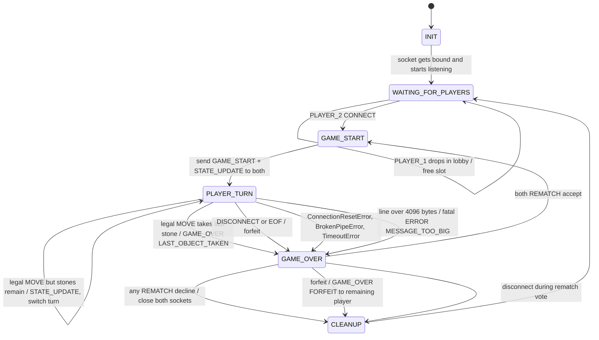

I used Python exceptions and such cause that's what the assignment desc does but IIRC we're using Java. Just in case I'm using Python exceptions here and in blueprint.

```mermaid
stateDiagram-v2
    [*] --> INIT

    INIT --> WAITING_FOR_PLAYERS : socket gets bound and starts listening

    WAITING_FOR_PLAYERS --> WAITING_FOR_PLAYERS : PLAYER_1 CONNECT / send LOBBY_WAIT
    WAITING_FOR_PLAYERS --> WAITING_FOR_PLAYERS : PLAYER_1 drops in lobby / free slot
    WAITING_FOR_PLAYERS --> GAME_START : PLAYER_2 CONNECT

    GAME_START --> PLAYER_TURN : send GAME_START + STATE_UPDATE to both

    PLAYER_TURN --> PLAYER_TURN : MOVE from inactive player / ERROR OUT_OF_TURN
    PLAYER_TURN --> PLAYER_TURN : unreadable or otherwise garbage line / ERROR MALFORMED_MESSAGE
    PLAYER_TURN --> PLAYER_TURN : CONNECT or REMATCH mid-round / ERROR WRONG_STATE
    PLAYER_TURN --> PLAYER_TURN : MOVE with invalid stack or count / ERROR INVALID_MOVE, same player
    PLAYER_TURN --> PLAYER_TURN : legal MOVE but stones remain / STATE_UPDATE, switch turn
    PLAYER_TURN --> GAME_OVER : legal MOVE takes last stone / GAME_OVER LAST_OBJECT_TAKEN
    PLAYER_TURN --> GAME_OVER : DISCONNECT or EOF / forfeit
    PLAYER_TURN --> GAME_OVER : ConnectionResetError, BrokenPipeError, TimeoutError
    PLAYER_TURN --> GAME_OVER : line over 4096 bytes / fatal ERROR MESSAGE_TOO_BIG

    GAME_OVER --> GAME_START : both REMATCH accept
    GAME_OVER --> CLEANUP : any REMATCH decline / close both sockets
    GAME_OVER --> CLEANUP : forfeit / GAME_OVER FORFEIT to remaining player
    GAME_OVER --> CLEANUP : disconnect during rematch vote

    CLEANUP --> WAITING_FOR_PLAYERS
```